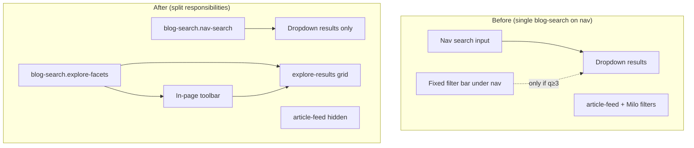

# Search facets refactor — change log & review

Branch context: **`search-facets`** (evolved from **`search-categories`**).

This document compares **before** vs **after** for the explore-facets work, lists touched files, and notes pros, cons, and risks. It covers only the search/facet feature changes—not unrelated local diffs (e.g. deleted `MDPlanningIPA/` docs) unless those are committed separately.

---

## Executive summary

| Area | Before | After |
|------|--------|--------|
| **Nav `<blog-search>`** | Search UI + **fixed filter bar** under global nav on (almost) every page | **Search only** in nav (icon, input, dropdown results) |
| **Article listing pages** | Milo **`article-feed`** filter UI (`filter-container`: Products / Industries) + feed cards | Additional **`<blog-search.explore-facets>`** injected above feed; legacy feed filters **hidden**; results shown in **explore card grid** inside the web component |
| **Filter without typing** | Facets mostly applied only when search query ≥ 3 characters | Explore mode: facets (+ optional search) drive grid via **`refreshExploreView()`** |
| **Layout** | Filter bar `position: fixed` below nav | Explore bar: in-page row (`Filters:` \| dropdowns \| date \| search icon) |

---

## Files changed (feature scope)

| File | Role |
|------|------|
| `web-components/search/blog-search.js` | Dual mode: `nav-search` vs `explore-facets`; facet init split; explore grid |
| `web-components/search/blog-search.css` | Explore toolbar/grid styles; fixed bar scoped to non-explore only |
| `scripts/scripts.js` | `nav-search` class on nav instance; `injectExploreFacets()` before article feed |
| `test/e2e/blog-search-filters.spec.js` | E2E targets `blog-search.explore-facets` |
| `test/test.html` | Manual harness for nav + explore variants |

---

## Behaviour: before vs after

### 1. Navigation search (`blog-search.nav-search`)

**Before**

- Component detected header/nav and rendered `nav-search-container` (icon + input + results).
- After load, **same component** also rendered a **fixed** `.filter-bar` (Category, Product, Author, Type, date) attached to shadow root.
- Filter changes called `handleSearch` only if input already had ≥ 3 characters.

**After**

- Nav instance gets explicit `nav-search` class in `scripts.js`.
- `isNavSearch` is true only when **not** explore and inside `header, .feds-topnav, .feds-nav`.
- **`initFacets()` is skipped** for nav → no fixed filter bar in header.
- Nav search behaviour unchanged (typeahead, debounce, topic scoping, URL `q` param).

### 2. Explore / “All articles” (`blog-search.explore-facets`)

**Before**

- No dedicated in-page facet UI from `blog-search`.
- Listing pages used **`article-feed`** `decorateFeedFilter()` (taxonomy-based Products / Industries, apply/reset pattern).

**After**

- On pages with `main .article-feed` or `.article-feed-post-process`, `scripts.js` injects:
  ```html
  <blog-search class="explore-facets" variant="explore"></blog-search>
  ```
  immediately **before** the feed block.
- Explore UI (shadow DOM):
  - **Toolbar:** `Filters:` label, horizontal facet controls, **search icon** (expands input on click).
  - **Facets shown (if data exists):** Products (`prod`), Category (`cat`), Topic (`type`), Date presets (`date`: last week / month / year).
  - **Results:** `.explore-results` — 3-column card grid (reuses `renderResult()` markup).
- **Suppressed:** `.article-feed`, `.filter-container`, `.selected-container` get `.explore-facets-suppressed` (`display: none`).
- **Initial load:** `refreshExploreView()` shows filtered or full index without requiring search text.

### 3. URL & state

**Unchanged (still supported)**

- Facet query params: `cat`, `prod`, `author`, `date`, `type` (multi-value via `URLSearchParams`).
- `replaceState` on filter change (no extra history entries).
- Search query `q` still used when explore search input has ≥ 3 characters.

**Explore-specific**

- Date `<select>` restored in explore mode (was accidentally excluded by explore group allowlist in first iteration).

### 4. New / refactored functions (`blog-search.js`)

| Symbol | Purpose |
|--------|---------|
| `exploreResultsContainer()` | Creates `.explore-results` grid container |
| `renderExploreResults()` | Renders facet/search results into explore grid |
| `refreshExploreView()` | Loads scoped data → optional `filterData()` → `applyFilters()` → grid |
| `applyFilterChange()` | Explore → `refreshExploreView()`; nav → legacy `handleSearch` if query long enough |
| `initFacets({ explore })` | Shared facet data load, bar, chips, listeners |

---

## Architecture diagram



---

## Pros

1. **Matches product intent** — Filters live on the listing/explore surface; search stays in nav (closer to reference mockup).
2. **Clearer separation of concerns** — Nav = discovery/typeahead; explore = browse + facet + optional text search.
3. **Better browse UX** — Users can filter articles without typing a 3+ character query first.
4. **Reuses existing logic** — `generateFacets`, `applyFilters`, `loadFiltersFromURL`, `filterData`, `renderResult` unchanged in spirit; lower regression risk for ranking/facet rules.
5. **Unit tests still valid** — `applyFilters` / `generateFacets` / `loadFiltersFromURL` tests target prototypes; no change to pure filter math.
6. **URL-shareable filters** — Same query-param model as before for bookmarking and reload (E2E T07–T09).

---

## Cons

1. **Duplicate listing systems** — Explore grid vs `article-feed` cards: two render paths, different HTML/CSS (explore cards ≠ Milo `buildArticleCard`).
2. **Legacy Milo filters disabled** — Products/Industries taxonomy UI hidden on pages with explore facets; authors lose “Apply” / curtain UX unless restored or merged.
3. **Two `<blog-search>` instances** — Nav + explore on feed pages: double fetch of `/query-index.json`, double shadow trees, more memory/DOM.
4. **Injection timing** — `injectExploreFacets()` runs once after `loadArea()`; feed added later via lazy block load would **not** get facets without a retry/MutationObserver.
5. **Facet labels vs data** — “Topic” maps to `articleType`; “Category” maps to first tag in `tags` JSON—may not match editorial taxonomy naming on all locales.
6. **Author facet omitted in explore** — Only `prod`, `cat`, `type`, `date` in explore bar; author still in URL model but no dropdown on explore UI.
7. **E2E assumptions** — Filter E2E tests require a page with **article-feed** + `blog-search.explore-facets`; homepage-only or paths without feed will fail T06–T13.

---

## Risks

| Risk | Severity | Notes |
|------|----------|--------|
| **SEO / accessibility** — Hidden `article-feed` still in DOM but not visible | Medium | Screen readers may still traverse suppressed feed unless `aria-hidden` added; crawlers might see duplicate content. |
| **Analytics** — Card clicks/layout differ from feed | Medium | DAA/tracking tied to `.article-card` may miss `.explore-results` links. |
| **Performance** — Full index rendered client-side on filter | Medium–High | Large `query-index.json` + re-render all matching cards; no pagination/load-more in explore grid. |
| **XSS / URL params** | Low (if unchanged) | Chip labels and checkbox values come from index data; E2E T11–T12 guard script injection; keep encoding rules when extending. |
| **Conflicting filter models** — Milo taxonomy vs query-index facets | Medium | `article-feed` filters by taxonomy topics; explore uses `cat`/`prod`/`type` from index fields—filters are **not** equivalent. |
| **Mobile** — Explore toolbar wraps on narrow screens | Low | Sub-600px rules allow wrap; may differ from design spec. |
| **Regression on non-feed pages** | Low | Nav no longer shows facets; pages that relied on global fixed bar lose that UI. |
| **Maintenance** — Two modes in one component | Medium | `connectedCallback` branching grows; future split into `blog-facets` element could reduce complexity. |

---

## Security notes (workspace rules)

- Facet values from URL are applied as **string filters**, not executed (`applyFilters` uses inclusion checks).
- No new `eval` / dynamic code paths introduced.
- Fetch remains to configured `data-source` (default `/en/query-index.json`) — SSRF risk unchanged from prior component.
- Ensure production `data-source` is same-origin or trusted CDN.

---

## Testing impact

| Suite | Change |
|-------|--------|
| `test/unit-tests/blog-search-facets.test.mjs` | Still applies (prototype methods) |
| `test/unit-tests/blog-search-filter-data.test.mjs` | Unchanged |
| `test/e2e/blog-search-filters.spec.js` | Uses `loadExploreFacets()` + `openExploreSearch()` |
| `test/e2e/blog-search.spec.js` | Still targets **nav** `blog-search` (first match)—verify it does not assume nav filter bar |
| Manual | `test/test.html` includes explore + stub `article-feed` |

**Manual check list**

1. Homepage (or any page with article-feed): toolbar horizontal; Category, Products, Topic, Date visible when index has values.
2. Nav: search works; **no** fixed filter strip under header.
3. Filter only (no search text): grid updates.
4. URL `?cat=…` reload: chips + grid match.
5. Clear all: params and chips removed.

---

## Revert / rollback

Revert feature-only files:

```bash
git checkout -- \
  web-components/search/blog-search.js \
  web-components/search/blog-search.css \
  scripts/scripts.js \
  test/e2e/blog-search-filters.spec.js \
  test/test.html
```

Or revert the whole branch vs `main` / `search-categories` depending on merge state.

---

## Possible follow-ups (not implemented)

1. Unify explore grid with `article-feed` cards (single render path).
2. Merge Milo taxonomy filters with query-index facets or drop one system.
3. Paginate / “Load more” in explore results.
4. `MutationObserver` to inject explore facets when feed mounts late.
5. Extract `<blog-facets>` web component to shrink `blog-search.js`.
6. Add `aria-hidden="true"` on suppressed feed for a11y.
7. Align labels with design system (e.g. Disciplines vs Topic).

---

## Revision history

| Date | Note |
|------|------|
| 2026-05-26 | Initial document after explore-facets implementation and layout/Category/date fixes |
